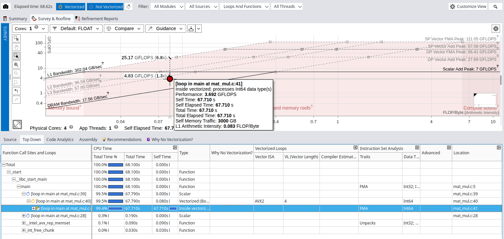
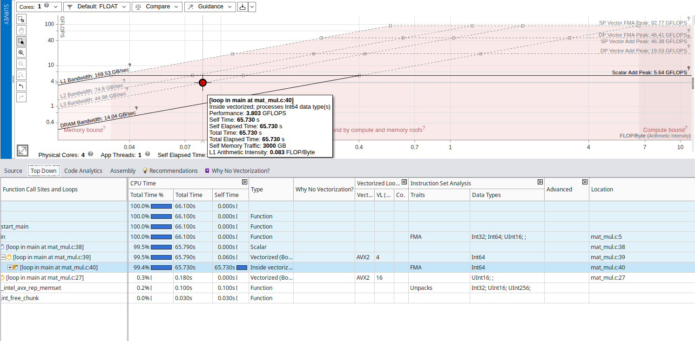

# Matrix Multiplication Parallelization

*Author: Marco Castagna*

## Head of the Analysis

The algorithm has a cubical time complexity of $O(N^3)$, requiring approximately $2N^3$ operations and dealing with an $O(N^2)$ data footprint.

**Tools:** I used the Intel C Compiler (`icx`) and the Intel Advisor GUI to perform most of the analysis.
**Machine:** SW2 Machine equipped with an Intel® Core™ i7-12700K Processor. It has 20 logical processors:

* 12 physical cores
* 8 Performance cores with Hyper-Threading up to 2
* 4 Efficiency cores

To accurately record the execution time, I decided to utilize the high-precision timers provided by the OpenMP library (`omp_get_wtime`).

The source code features a design optimization where the nested loops are inverted compared to the standard mathematical matrix multiplication formula. As discussed in class, this loop order (`i-k-j`) allows us to exploit the cache lines through both spatial and temporal locality. Although this shifts the memory stores from $O(N^2)$ to $O(N^3)$, the rewritten algorithm significantly saves memory read time by avoiding cache misses, ultimately increasing performance.

## **Hotspot Identification**

Starting with a baseline approach, I compiled the code disabling all optimizations (`icx -g -O0 -xHost -fiopenmp -o matmul mat_mul.c`) and analyzed the algorithm with **Data size** = 2000, resulting in a computation time of 14.401241 seconds. I then decided to roughly double the size to $N=5000$, which yielded a computation time of 227.614839
The hotspot resides at row 40 (`for (j = 0; j < n; ++j)`): this single loop consumes 99.9% of the total execution time (227.353s out of the 227.61s total).

By compiling with `-O0`, the compiler refused to use AVX vector instructions. Furthermore, as clearly captured by Intel Advisor (which flags the loop with **`Int64`** traits instead of Double Precision), the machine is spending a massive amount of scalar clock cycles computing array indices and pointer arithmetic rather than the actual floating-point math. This massive overhead is reflected in the huge execution time (~227 seconds for a $5000 \times 5000$ matrix).

The naive algorithm is heavily Memory Bound, but with an important architectural nuance. The Roofline Model places the main hotspot just below the **L3 Cache Bandwidth** diagonal (hotspot performance 1.1Gflops while l3 cache at the same aritmethic intensity achieve 1.13 GFLOPS with  an effective bandwidth of ~67.78 GB/s), rather than falling all the way down to the DRAM limit. With an arithmetic intensity of just 0.017 FLOP/Byte, the lack of register allocation caused by the `-O0` flag is evident. Theoretically, the core operation `c[i][j] += a[i][k] * b[k][j]` should have an intensity of $2 \text{ FLOP} / 32 \text{ Byte} = 0.0625$. This massive drop is a direct consequence of the compiler reloading loop variables and array elements from the memory stack at every single iteration. However, because the loop sequence is optimized (`i-k-j`), the memory access pattern exhibits excellent spatial locality. This contiguous access allows the CPU's hardware prefetcher to effectively pull data from the DRAM into the L3 cache ahead of time. Consequently, the execution is not bottlenecked by the bare DRAM latency, but rather by the L3 bandwidth and the purely scalar instructions.

---

## Vectorization Analysis and Best Sequential Time

To fix the memory bottleneck and the slow scalar execution from the baseline, I used the compiler's advanced optimizations for the SW2 machine's architecture.

**Compiling line:** `icx -g -O3 -xHost -fiopenmp -qopt-report=3 -o matmul mat_mul.c`
**Data size:** RESOLUTION = 5000
**Time taken:** 9.547438 seconds

Using the `-O3` and `-xHost` flags reduced the execution time significantly. To see exactly what the compiler did, I checked the vectorization report (`-qopt-report=3`). Because the nested loops in our code are inverted (`i-k-j`), there are no data dependencies, allowing for perfect vectorization. The `mat_mul.optrpt` file confirmed that the innermost loop (`for j = 0; j < n; ++j`) was successfully vectorized. The compiler used a vector length of 4 (`vector length 4`), which means it packed four 64-bit double-precision variables into 256-bit AVX2 registers.

Running Intel Advisor on this optimized program confirms the compiler's report and shows a completely transformed Roofline Model:

- **Instruction Set and FMA:** The hotspot changed from scalar `Int64` arithmetic to vectorized operations using **FMA** (Fused Multiply-Add). The CPU now performs the addition and multiplication together in a single hardware step.
- **Arithmetic Intensity:** The intensity increased from 0.017 FLOP/Byte to **0.083 FLOP/Byte**. This proves the compiler placed the variables into fast CPU registers, preventing slow memory reloads.
- **Performance Bound:** The hotspot moved much higher on the graph, reaching **3.692 GFLOPS** (up from 0.644 GFLOPS). This shifts the bottleneck away from memory latency and closer to the actual compute limits of the architecture.

---

## Advanced Compiler Optimizations and Best Sequential Time

After setting a strong baseline with `-O3` and `-xHost`, I tested advanced compiler flags to maximize sequential performance:

* **`-xHost`**: Tells the compiler to use the best instructions for the specific CPU running the code (enabling AVX2/FMA).
* **`-ffast-math`**: Relaxes strict floating-point rules, allowing the compiler to reorder math operations for faster execution.
* **`-ipo` (Interprocedural Optimization)**: Analyzes the whole program at once to optimize how data flows between functions.
* **`-fno-alias`**: Tells the compiler that the arrays (`a`, `b`, `c`) do not overlap in memory. This removes slow safety checks.

To measure the impact of these flags, I ran the algorithm with $N=5000$ using different combinations:

| Compiler Flags | Execution Time |
| --- | --- |
| `-O3 -xHost` (Baseline) | 72.359393 seconds |
| `-O3 -xHost -ffast-math` | 71.966849 seconds |
| `-O3 -xHost -ipo` | 70.703261 seconds |
| `-O3 -xHost -fno-alias` | 71.526865 seconds |
| `-O3 -xHost -ipo -ffast-math -fno-alias` | 71.514240 seconds |

By exploiting these optimization flags, I achieved a further reduction in the hotspot execution time. I also checked the new Roofline Model for the fully optimized version:

The graph provides visual proof that the hardware is utilized more efficiently, with the GFLOPS increasing accordingly. Because this configuration extracts the maximum compute power from a single core, I decided to use -ipo execution time of **70.70 seconds** as our **Best Sequential Time ($T_1$)**.

---
## OpenMP

#pragma omp parallel for private(j, k) schedule(dynamic) dynamic scheduling : 27.032384 seconds
#pragma omp parallel for private(j, k) schedule(static) static scheduling: 31.561300 seconds

static con default(none) shared(a, b, c, n) private(j, k)
34.768416 seconds
dynamic con default(none) shared(a, b, c, n) private(j, k)
29.145954 seconds

con solo 4 thread e static scheduler 19.030195 seconds

4 thread e dynamic
17.642768 seconds

comandi utili 
scrot -s screenshot.png
