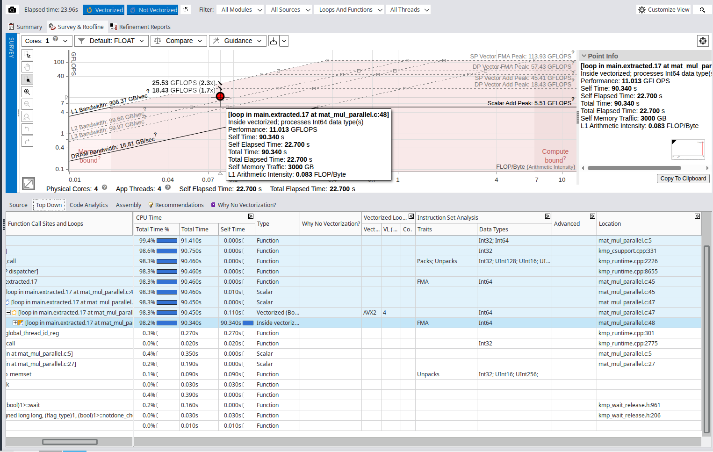

# Matrix Multiplication Parallelization

*Author: Marco Castagna*

## Head of the Analysis

The algorithm has a cubical time complexity of $O(N^3)$, requiring approximately $2N^3$ operations and dealing with an $O(N^2)$ data footprint.

**Tools:** I used the Intel C Compiler (`icx`) and the Intel Advisor GUI to perform most of the analysis.
**Machine:** SW2 Machine equipped with an Intel® Core™ i7-12700K Processor. It has 20 logical processors:

* 12 physical cores
* 8 Performance cores with Hyper-Threading up to 2
* 4 Efficiency cores

To accurately record the execution time, I decided to utilize the high-precision timers provided by the OpenMP library (`omp_get_wtime`).

The source code features a design optimization where the nested loops are inverted compared to the standard mathematical matrix multiplication formula. As discussed in class, this loop order (`i-k-j`) allows us to exploit the cache lines through both spatial and temporal locality. Although this shifts the memory stores from $O(N^2)$ to $O(N^3)$, the rewritten algorithm significantly saves memory read time by avoiding cache misses, ultimately increasing performance.

## **Hotspot Identification**

Starting with a baseline approach, I compiled the code disabling all optimizations (`icx -g -O0 -xHost -fiopenmp -o matmul mat_mul.c`) and analyzed the algorithm with **Data size** = 2000, resulting in a computation time of 14.401241 seconds. I then decided to roughly double the size to $N=5000$, which yielded a computation time of 227.614839
The hotspot resides at row 40 (`for (j = 0; j < n; ++j)`): this single loop consumes 99.9% of the total execution time (227.353s out of the 227.61s total).

By compiling with `-O0`, the compiler is forced to generate naive scalar instructions, completely bypassing the AVX vector capabilities. While Intel Advisor confirms the loop correctly processes **`Float64`** data, the massive execution time (~227 seconds) is driven by the total lack of register allocation. Without optimizations, the CPU is forced to reload loop indices and matrix elements from the memory hierarchy at every single iteration, executing one purely scalar addition and multiplication at a time.

The naive algorithm is heavily Memory Bound, but with an important architectural nuance. The Roofline Model places the main hotspot just below the **L3 Cache Bandwidth** diagonal (almoast achieving 1.13 GFLOPS with an effective bandwidth of ~67.78 GB/s), rather than falling all the way down to the DRAM limit. With an arithmetic intensity of just 0.017 FLOP/Byte, the lack of register allocation caused by the `-O0` flag is evident. Theoretically, the core operation `c[i][j] += a[i][k] * b[k][j]` should have an intensity of $2 \text{ FLOP} / 32 \text{ Byte} = 0.0625$. This massive drop is a direct consequence of the compiler reloading loop variables and array elements from the memory stack at every single iteration. However, because the loop sequence is optimized (`i-k-j`), the memory access pattern exhibits excellent spatial locality. This contiguous access allows the CPU's hardware prefetcher to effectively pull data from the DRAM into the L3 cache ahead of time. Consequently, the execution is not bottlenecked by the bare DRAM latency, but rather by the L3 bandwidth and the purely scalar instructions.

---

## Vectorization Analysis and Best Sequential Time

To fix the memory bottleneck and the slow scalar execution from the baseline, I used the compiler's advanced optimizations for the SW2 machine's architecture.

**Compilation command:** `icx -g -O3 -xHost -fiopenmp -qopt-report=3 -o matmul mat_mul.c`
**Data size:** N = 5000
**Execution Time:** 9.54 seconds

Using the `-O3` and `-xHost` flags reduced the execution time by a factor of ~24x. To understand this massive speedup, I analyzed the vectorization report (`-qopt-report=3`). Because the nested loops are perfectly arranged (`i-k-j`) to respect spatial locality, the compiler successfully vectorized the innermost loop (`j`). The code was compiled using **AVX2** instructions with a physical vector length of 4 (packing four 64-bit `double` variables into a 256-bit register). Furthermore, the compiler applied aggressive **Loop Unrolling** (processing 8 elements per iteration) to keep the execution units fully saturated.

Running Intel Advisor on this optimized program confirms the report and shows a completely transformed Roofline Model:

* **Instruction Set and FMA:** The hotspot transitioned from slow *Scalar Float64* execution to *Vectorized AVX2*. Crucially, it now leverages **FMA** (Fused Multiply-Add) hardware units, performing addition and multiplication simultaneously in a single hardware step.
* **Arithmetic Intensity:** The L1 Arithmetic Intensity improved significantly to **0.200 FLOP/Byte**. This proves that the variables are being efficiently reused within the fast CPU registers and L1 cache, drastically reducing the slow memory reloads.
* **Compute Performance:** The hotspot moved dramatically higher on the graph, peaking at **27.03 GFLOPS** (up from just 1.13 GFLOPS in the scalar baseline). This proves the bottleneck has shifted away from memory latency and is now fully exploiting the compute capabilities of the single physical core.

---

## Advanced Compiler Optimizations and Best Sequential Time

After setting a strong baseline with `-O3` and `-xHost`, I decide to increase the problem size from N 5000 to 10000 and
 test the advanced compiler flags to maximize sequential performance:

* **`-xHost`**: Tells the compiler to use the best instructions for the specific CPU running the code (enabling AVX2/FMA).
* **`-ffast-math`**: Relaxes strict floating-point rules, allowing the compiler to reorder math operations for faster execution.
* **`-ipo` (Interprocedural Optimization)**: Analyzes the whole program at once to optimize how data flows between functions.
* **`-fno-alias`**: Tells the compiler that the arrays (`a`, `b`, `c`) do not overlap in memory. This removes slow safety checks.

To measure the impact of these flags, I ran the algorithm with $N=10000$ using different combinations:

| Compiler Flags | Execution Time |
| --- | --- |
| `-O3 -xHost` (Baseline) | 76.069008 seconds |
| `-O3 -xHost -ffast-math` | 77.634956 seconds |
| `-O3 -xHost -ipo` | 79.276426 seconds |
| `-O3 -xHost -fno-alias` | 77.424665 seconds |
| `-O3 -xHost -ipo -ffast-math -fno-alias` | 82.712974 seconds |
 

**Analysis of the Results**

Increasing the matrix dimension to $N=10000$ means each matrix takes up roughly 800 MB, resulting in about 2.4 GB of total RAM usage. At this massive scale, the baseline `-O3 -xHost` configuration provided the best sequential time.

Breaking down the lack of improvement from the advanced flags:

**`-ipo`:** This flag did not improve performance because all our core logic resides exclusively within the `main` function, making the optimization completely unnecessary.
**`-ffast-math`:** Since our algorithm only relies on a basic multiply-add operation, there are no complex mathematical functions (like square roots or transcendentals) for the compiler to simplify or "cheat" on. The hardware FMA is already doing the absolute minimum work possible.
**`-fno-alias`:** This flag tells the compiler the matrices do not overlap. However, the compiler is already smart enough to generate clean, vectorized AVX2 code. Removing the microscopic safety check for memory overlap saves an insignificant amount of time compared to the massive 2.4 GB memory transfer.

Therefore, the baseline compilation command (`icx -g -O3 -xHost -fiopenmp -o matmul mat_mul.c`) perfectly applies vectorization without over-complicating the memory access, yielding our **Best Sequential Time of 76.06 seconds**.

---

## OpenMP

#pragma omp parallel for private(j, k) schedule(dynamic) dynamic scheduling : 27.032384 seconds
#pragma omp parallel for private(j, k) schedule(static) static scheduling: 31.561300 seconds

static con default(none) shared(a, b, c, n) private(j, k)
34.768416 seconds
dynamic con default(none) shared(a, b, c, n) private(j, k)
29.145954 seconds

con solo 4 thread e static scheduler 19.030195 seconds

4 thread e dynamic
17.642768 seconds

sw2 results:
avendo una architettura ibrida (core differenti) ho scelto lo scheduler dinamico
I'm using 20 OpenMP Thread
Computation time (N=10000): 36.141804 seconds
subito a d occchio mi sorge uno scettisismo avere 20 thread e passare da 76 secondi sequenzale in 36 secondi, c'e poco speed up
e guardando il roofline sorgono alcuni spunti:

comandi utili 
scrot -s screenshot.png
advixe-gui
