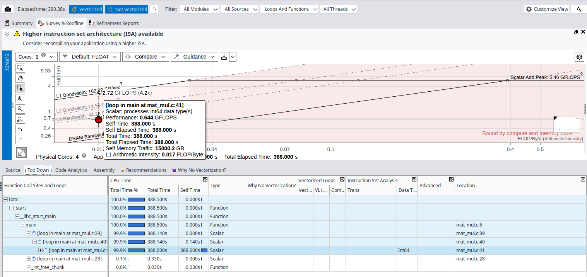
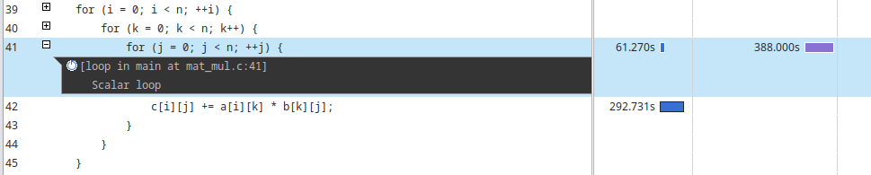

# Matrix Multiplication Parallelization

*Author: Marco Castagna*

## Head of the Analysis

The algorithm has a cubical time complexity of $O(N^3)$, requiring approximately $2N^3$ operations and dealing with an $O(N^2)$ data footprint.

**Tools:** I used the Intel C Compiler (`icx`) and the Intel Advisor GUI to perform most of the analysis.
**Machine:** SW2 Machine equipped with an Intel® Core™ i7-12700K Processor. It has 20 logical processors:

* 12 physical cores
* 8 Performance cores with Hyper-Threading up to 2
* 4 Efficiency cores

To accurately record the execution time, I decided to utilize the high-precision timers provided by the OpenMP library (`omp_get_wtime`).

The source code features a design optimization where the nested loops are inverted compared to the standard mathematical matrix multiplication formula. As discussed in class, this loop order (`i-k-j`) allows us to exploit the cache lines through both spatial and temporal locality. Although this shifts the memory stores from $O(N^2)$ to $O(N^3)$, the rewritten algorithm significantly saves memory read time by avoiding cache misses, ultimately increasing performance.

*

Tranquillo, facciamo ordine! Hai incollato una versione "ibrida" che si è persa per strada le due correzioni "da pro" che abbiamo fatto guardando bene le immagini (quella sull'`Int64` e quella sulla Cache L3 vs DRAM).

Per non farti impazzire col copia-incolla, ho preso **tutto** il blocco della sezione "Hotspot Identification", l'ho unito, limato e ho inserito tutte le correzioni definitive.

Questo è il testo **finale e completo** che puoi prendere e incollare direttamente nel tuo report, senza doverci più pensare:

---

**Hotspot Identification**

Starting with a baseline approach, I compiled the code disabling all optimizations (`icx -g -O0 -xHost -fiopenmp -o matmul mat_mul.c`) and analyzed the algorithm with **Data size** = 2000, resulting in a computation time of 25.60 seconds. I then decided to roughly double the size to $N=5000$, which yielded a computation time of 390.00 seconds.

The hotspot resides at row 41 (`for (j = 0; j < n; ++j)`): this single loop consumes 99.6% of the total execution time (388.0s out of the 390s total).

By compiling with `-O0`, the compiler refused to use AVX vector instructions. Furthermore, as clearly captured by Intel Advisor (which flags the loop with **`Int64`** traits instead of Double Precision), the machine is spending a massive amount of scalar clock cycles computing array indices and pointer arithmetic rather than the actual floating-point math. This massive overhead is reflected in the gigantic execution time (~390 seconds for a $5000 \times 5000$ matrix).

The naive algorithm is heavily Memory Bound, but with an important architectural nuance. The Roofline Model places the main hotspot just below the **L3 Cache Bandwidth** diagonal (achieving an effective bandwidth of ~37.8 GB/s), rather than falling all the way down to the DRAM limit. With an arithmetic intensity of just 0.017 FLOP/Byte, the lack of register allocation caused by the `-O0` flag is evident. Theoretically, the core operation `c[i][j] += a[i][k] * b[k][j]` should have an intensity of $2 \text{ FLOP} / 32 \text{ Byte} = 0.0625$. This massive drop is a direct consequence of the compiler reloading loop variables and array elements from the memory stack at every single iteration. However, because the loop sequence is optimized (`i-k-j`), the memory access pattern exhibits excellent spatial locality. This contiguous access allows the CPU's hardware prefetcher to effectively pull data from the DRAM into the L3 cache ahead of time. Consequently, the execution is not bottlenecked by the bare DRAM latency, but rather by the L3 bandwidth and the purely scalar instructions.

---

**Vectorizzation**
For the vectorization i decide to use level 3

icx -g -O3 -xHost -fiopenmp -qopt-report=3 -o matmul mat_mul.c

Computation time (N=5000): 63.727352 seconds
