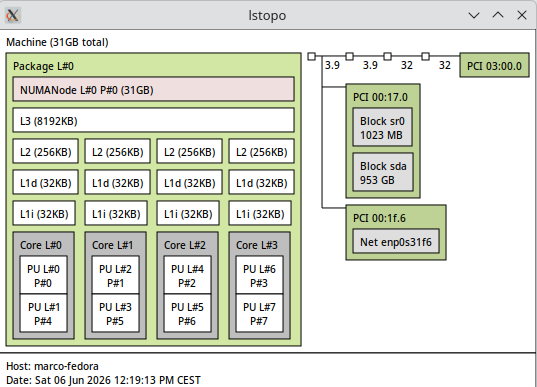
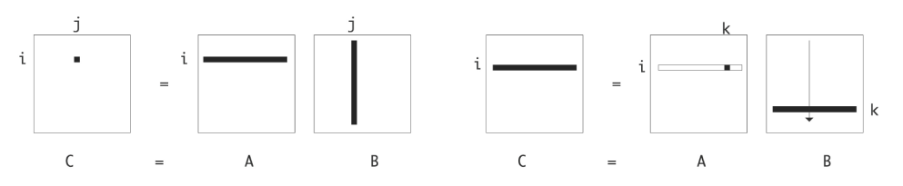
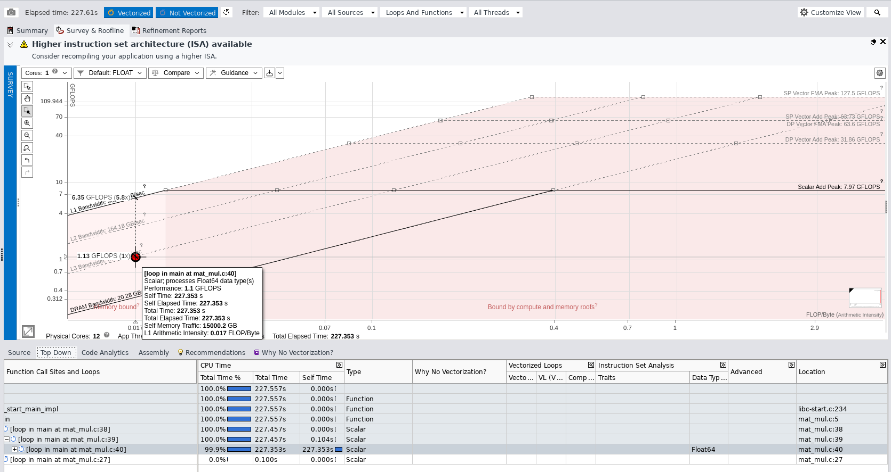
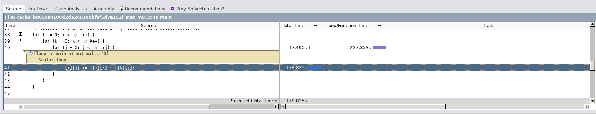
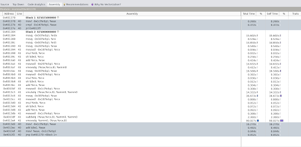
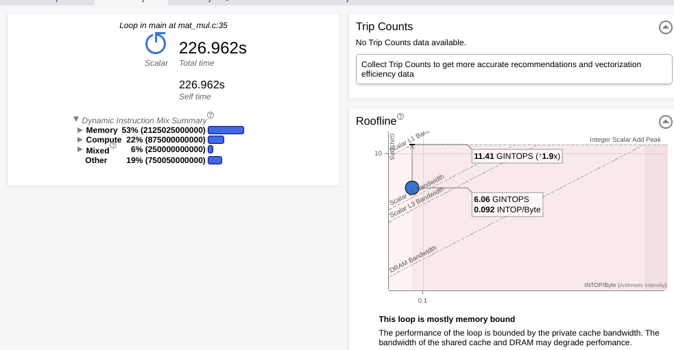
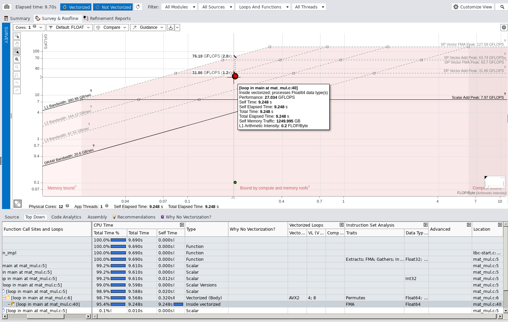
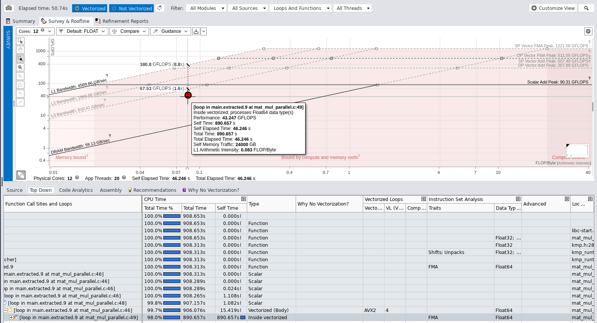

# Matrix Multiplication Parallelization

*Author: Marco Castagna*

## Head of the Analysis

The algorithm has a cubic time complexity of $O(N^3)$, requiring approximately $2N^3$ operations and dealing with an $O(N^2)$ data footprint.

**Tools:** I used the Intel C Compiler (`icx`) and the Intel Advisor GUI to perform most of the analysis.
**Machine:** 210 room's Machine equipped with an Intel® Core™ i9-12900K Processor. It has 24 logical processors:

* 16 physical cores
* 8 Performance cores with Hyper-Threading up to 2
* 8 Efficiency cores



To accurately record the execution time, I decided to utilize the high-precision timers provided by the OpenMP library (`omp_get_wtime`).

The source code features a design optimization where the nested loops are inverted compared to the standard mathematical matrix multiplication formula. As discussed in class, this loop order (`i-k-j`) allows us to exploit the cache lines through both spatial and temporal locality. Although this shifts the memory stores from $O(N^2)$ to $O(N^3)$, the rewritten algorithm significantly saves memory read time by avoiding cache misses, ultimately increasing performance.




## **Hotspot Identification**

Starting with a baseline approach, I compiled the code disabling all optimizations (`icx -g -O0 -xHost -fiopenmp -o /bin/matmul mat_mul.c`) and analyzed the algorithm with **Data size** = 2000, resulting in a computation time of 14.400218 seconds. I then decided to double the size to $N=5000$, which yielded a computation time of 227.300751 seconds
The hotspot resides at row 35 (`for (j = 0; j < n; ++j)`): this single loop consumes 99.9% of the total execution time (227.353s out of the 227.30s total).


By compiling with `-O0`, the compiler is forced to generate naive scalar instructions, completely bypassing the AVX vector capabilities. While Intel Advisor confirms the loop correctly processes **`Float64`** data, the massive execution time (~227 seconds) is driven by the total lack of register allocation. Without optimizations, the CPU is forced to reload loop indices and matrix elements from the memory hierarchy at every single iteration, executing one purely scalar addition and multiplication at a time.




The unoptimized algorithm is heavily memory-bound, but the Roofline Model reveals an interesting detail: the main hotspot sits just below the L3 Cache Bandwidth limit (~67.78 GB/s and 1.13 GFLOPS), instead of dropping down to the slower DRAM limit.

The arithmetic intensity is very low (only 0.017 FLOP/Byte), compared to the theoretical value of 0.0625 (2 FLOPs / 32 Bytes) for the core operation c[i][j] += a[i][k] * b[k][j]. This drop happens because the -O0 flag disables register allocation. As a result, the compiler is forced to constantly reload loop variables and array pointers from the memory stack during every iteration.

However, since the loop sequence is optimized (i-k-j), the memory access is contiguous (good spatial locality). This allows the CPU's hardware prefetcher to bring data from the RAM into the L3 cache ahead of time. Because of this, the execution is bottlenecked by the L3 cache bandwidth and the use of scalar instructions, rather than the slow DRAM latency.




Figure X: Assembly code compiled with -O0. The highlighted memory instructions (using the %rbp base pointer) show that loop counters and array pointers are continuously reloaded from the stack. This explains why memory instructions make up 53% of the total execution overhead.

---

## Vectorization Analysis and Best Sequential Time

To fix the memory bottleneck and the slow scalar execution from the baseline, I used the compiler's advanced optimizations for the SW2 machine's architecture.

**Compilation command:** `icx -g -O3 -xHost -fiopenmp -qopt-report=3 -o /bin/matmul mat_mul.c`
**Data size:** N = 5000
**Execution Time:** 9.54 seconds

Using the `-O3` and `-xHost` flags reduced the execution time by a factor of ~24x. To understand this massive speedup, I analyzed the vectorization report (`-qopt-report=3`). Because the nested loops are perfectly arranged (`i-k-j`) to respect spatial locality, the compiler successfully vectorized the innermost loop (`j`). The code was compiled using **AVX2** instructions with a physical vector length of 4 (packing four 64-bit `double` variables into a 256-bit register). Furthermore, the compiler applied aggressive **Loop Unrolling** (processing 8 elements per iteration) to keep the execution units fully saturated.

Running Intel Advisor on this optimized program confirms the report and shows a completely transformed Roofline Model:


* **Instruction Set and FMA:** The hotspot transitioned from slow *Scalar Float64* execution to *Vectorized AVX2*. Crucially, it now leverages **FMA** (Fused Multiply-Add) hardware units, performing addition and multiplication simultaneously in a single hardware step.
* **Arithmetic Intensity:** The L1 Arithmetic Intensity improved significantly to **0.200 FLOP/Byte**. This proves that the variables are being efficiently reused within the fast CPU registers and L1 cache, drastically reducing the slow memory reloads.
* **Compute Performance:** The hotspot moved dramatically higher on the graph, peaking at **27.03 GFLOPS** (up from just 1.13 GFLOPS in the scalar baseline). This proves the bottleneck has shifted away from memory latency and is now fully exploiting the compute capabilities of the single physical core.

---

## Advanced Compiler Optimizations and Best Sequential Time

After setting a strong baseline with `-O3` and `-xHost`, I decide to increase the problem size from N 5000 to 10000 and
 test the advanced compiler flags to maximize sequential performance:

* **`-xHost`**: Tells the compiler to use the best instructions for the specific CPU running the code (enabling AVX2/FMA).
* **`-ffast-math`**: Relaxes strict floating-point rules, allowing the compiler to reorder math operations for faster execution.
* **`-ipo` (Interprocedural Optimization)**: Analyzes the whole program at once to optimize how data flows between functions.
* **`-fno-alias`**: Tells the compiler that the arrays (`a`, `b`, `c`) do not overlap in memory. This removes slow safety checks.

To measure the impact of these flags, I ran the algorithm with $N=10000$ using different combinations:

| Compiler Flags | Execution Time |
| --- | --- |
| `-O3 -xHost` (Baseline) | 76.069008 seconds |
| `-O3 -xHost -ffast-math` | 77.634956 seconds |
| `-O3 -xHost -ipo` | 79.276426 seconds |
| `-O3 -xHost -fno-alias` | 77.424665 seconds |
| `-O3 -xHost -ipo -ffast-math -fno-alias` | 82.712974 seconds |
 

**Analysis of the Results**

Increasing the matrix dimension to $N=10000$ means the static memory footprint of each matrix is roughly 800 MB, resulting in about 2.4 GB of total RAM allocation. At this massive scale, the baseline `-O3 -xHost` configuration provided the best sequential time.

Breaking down the lack of improvement from the advanced flags:

**`-ipo`:** This flag did not improve performance because all our core logic resides exclusively within the `main` function, making the optimization completely unnecessary.
**`-ffast-math`:** Since our algorithm only relies on a basic multiply-add operation, there are no complex mathematical functions (like square roots or transcendental functions such as exponentials and logarithms) for the compiler to simplify or "cheat" on. The hardware FMA is already doing the absolute minimum work possible.
**`-fno-alias`:** This flag tells the compiler the matrices do not overlap. However, the compiler is already smart enough to generate clean, vectorized AVX2 code without it.

Therefore, the baseline compilation command (`icx -g -O3 -xHost -fiopenmp -o matmul mat_mul.c`) perfectly applies vectorization without over-complicating the memory access, yielding our **Best Sequential Time of 76.06 seconds**.

---


## OpenMP
icx -g -O3 -xHost -fiopenmp -o matmul_p mat_mul_parallel.c

ho deciso di inserire  #pragma omp parallel for default(none) shared(a, b, c, n) private(j, k) schedule(dynamic) nel primo dei 3 cicli for 
```c
#pragma omp parallel for default(none) shared(a, b, c, n) private(j, k) schedule(dynamic)
    for (i = 0; i < n; ++i) {
        for (k = 0; k < n; k++) {
            for (j = 0; j < n; ++j) {
                c[i][j] += a[i][k] * b[k][j];
            }
        }
    }
```
quindi i thread si suddividono l'esecuzionee di quel ciclo,
quindi ogni thread che esegue una sola iterazione `i` del primo for, esegue i due cicli sottostanti interamente quindi nxn iterazioni
, ho sceltò così in modo da evitare race condition e dare ad ogni thread la possibilità di eseguire in pace la sua porzione di dati
avendo una architettura ibrida (core differenti) ho scelto lo scheduler dinamico
ma se avessi usato lo scheduler statico
avrei ad esempio se N=10k ogni thread  10000 / 20 = 500 iterazioni `i` del primo for, ma usando lo scheduler dinamico quidni dando il potere della scelta allo scheduler non sarà esatamente distribuito così egualmente su tutti ma man mano ogni thread prende i blocchi quando è disponibile, avendo aperò alla fine distribuione probabilemnte simile , infatti  ho sperimentato verie volte eseguendo lo stesso codice ma con scheduler statico, notando che che l'esecuzioni con scheduler dinamico sono sempre leggermente piu brevi, facendomi pensare che si crea questo load imbalance/overhead nei core piu lenti e con cache piu piccola,
ad esempio con n=10k
static
39.768416 seconds
dynamic
34.145954 seconds


### risultati e analisi
avendo
Computation time (N=10000): 36.141804 seconds
subito ad occchio mi sorge dubbio: sono molto scettico ad avere 20 thread e passare da 76 secondi sequenzale in 36 secondi, noto subito che c'e poco speed up
e guardando il roofline sorgono alcuni ulteriori dubbi:


sembra la situazione iniziale in cui si dipende da quanto la memoria è veloce a dare i dati

potrebbe essere un false sharing? ragionando
non dovrei avere in un problema di false sharing, prprio perchè ogni thread non si tocca avendo la propria porzioni di tati, potrebbe essere un numa effect? la risposta cè che l'architettura del pc non ha diverse memorie ram separate per ogni cpu quindi non dovrebbe essere un problema proprio prchè la ram è la stessa

c'è comunque  un problema di cache miss...
sappiamo che
Compulsory Miss: La prima volta che leggi un dato. (Inevitabile),
conflict misses: Quello causato dal False Sharing. (scartato),
Capacity Miss: (IL PROBLEMA).

facendo due calcoli con n=10000, ogni thread con una sola iterazione i :
per esempio thread 0 prende i=0
deve eseguire gli altri due cicli interi (k e j da 0 a 9999).
La formula matematica è: c[0][j] += a[0][k] * b[k][j]
per calcolare la riga c il thread ha bisogno
della riga 0 di A: Sono 10.000 elementi double. Pesano circa 80 KB. Nessun problema, entrano comodamente nella Cache L1 o L2 del core
poi però la formula richiede di scorrere b[k][j] questo significa deve sorrere **LA MATRICE B** per intero! 10000x10000 pesa 800 MB. che da solo riempe l1d, l2 e tutta l3(condivisa)

c'è tanta potenza di calcolo, ma tante richieste in coda da parte dei thread letteramente bloccano la ram, ogni thread ha bisogno una quantita di dati che non entra in cache e quindi non si sfrutta bene il parllelismo andano a chiedere in ram tutti simultaneamente e sovrascrivendo continuamente la chache l3 condivisa.
passano il 90% del loro tempo fermi, in attesa che il bus di memoria, completamente intasato, consegni i dati dalla RAM

una soluzione nota è quella di riscrivere l'algoritmo, dividere meglio i blocchi dei dati in modo che entrino in cache, applicare soluzioni come loop tiling, Cache-Aware Architecture (The GotoBLAS approach), Cache-Oblivious Algorithms come i due paper menzionati nelle slide.
a questo punto ho deciso di applicare il loop tiling anninando dei cicli e dividento i blocchi delimitati afficnhè non si rpiempa subito le cache, ma sopratutto aumentando molto di piu la grana, dando la possibilità di sfruttare al meglio la performance dei core, non è la suluzione definitiva, ci sono molti modi piu precisi per aumentare la perfomance, il mio obbiettivo è quello di rompere questo Memory Wall che si è creato con l'algoritmo classico    
```c
#pragma omp parallel for default(none) shared(a, b, c, n, BLOCK_SIZE) schedule(dynamic)
    for (int i = 0; i < n; i += BLOCK_SIZE) {
        for (int k = 0; k < n; k += BLOCK_SIZE) {
            for (int j = 0; j < n; j += BLOCK_SIZE) {
                
                // CALCOLO DEI BORDI 
                // per esempio N=10000 non è perfettamente divisibile per 64, agli angoli 
                // della matrice l'ultimo blocco sarà "mozzato". Questo evita i Segmentation Fault.
                int i_end = (i + BLOCK_SIZE > n) ? n : i + BLOCK_SIZE;
                int k_end = (k + BLOCK_SIZE > n) ? n : k + BLOCK_SIZE;
                int j_end = (j + BLOCK_SIZE > n) ? n : j + BLOCK_SIZE;

                // --- INIZIO DEL MICRO-MONDO (Dentro il blocco in Cache) ---
                for (int ii = i; ii < i_end; ++ii) {
                    for (int kk = k; kk < k_end; ++kk) {
                        
                        // Questo ciclo verrà vettorializzato in AVX2/FMA dal compilatore
                        for (int jj = j; jj < j_end; ++jj) {
                            c[ii][jj] += a[ii][kk] * b[kk][jj];
                        }
                        
                    }
                }
```
in questo modo ogni thread non riempe la cache del core e non intasa la l3, apsettando che la ram gli dia i dati.
Seguendo **PCAM Methodology** (Partitioning, Communication, Agglomeration, Mapping) vista nel corso, inifne possiamo dire che l'algoritmo è stato sviluppato

### 1. Partitioning (Partizionamento)
 Ho applicato quella che le slide chiamano *Domain decomposition*. Invece di guardare alle matrici come a un unico blocco monolitico da $10000 \times 10000$, ho partizionato il dominio dei dati introducendo i cicli interni. Quindi diviso lo spazio in "mattonelle" microscopiche da $64 \times 64$ elementi, che rappresentano l'unità fondamentale del calcolo.

### 2. Communication (Comunicazione)

L'algoritmo è stato progettato puntando alla situazione ideale: *No need for communications*. Come indicano le slide, si tratta di problemi che possono essere scomposti ed eseguiti in parallelo senza quasi alcun bisogno di condividere dati tra i task. Assegnando a ogni thread una striscia orizzontale indipendente della matrice C, ho evitato qualsiasi collisione. Non c'è stato uso di `lock`, `barrier` , né operazioni collettive costose come le `reduction`. Ogni thread lavora nel totale isolamento della sua Cache.

### 3. Agglomeration (Agglomerazione)

 Non ho dato in pasto a OpenMP i singoli quadratini $64 \times 64$ (che avrebbero generato una granularità troppo fine e un overhead di comunicazione mostruoso ). Invece ho **agglomerato** il lavoro posizionando il `#pragma omp parallel for` solo sul ciclo più esterno `i`. Così facendo, ho impachettato intere "strisce" da 64 righe per 10.000 colonne in un singolo maxi-task. Questo garantisce un altissimo rapporto tra calcolo e comunicazione, permettendo al thread di macinare calcoli per decine di secondi senza mai fermarsi (coarse grain) .

### 4. Mapping (Mappatura)
Delegato il compito allo scheduler, approccio master-slave/worker paradigm , usando  `schedule(dynamic)` con OpenMp


### risultati
sbalorditivo
sul mio i7 6700
single core vettorizzato xhost 03 etc ./matmul 10000
Computation time (N=10000): 573.019573 seconds
con algoritmo originale parallelo 
./matmul_p 10000
I'm using 8 OpenMP Thread
Computation time (N=10000): 329.788830 seconds

con alogirtmo parallelo otttimizzato blocchi da 64
Computation time (N=10000): 51.348811 seconds

ora vedo un vantaggio nell'tilizzo del parallelismo rispetto a prima

investighiamo come l'algoritmo ora scala bene per dimensioni di 5k, 10k 15k
e per il numero di thread in termin di speed up ed efficiency


## scalabilità
grafici generati dal benchmark.sh


## CUDA

La divisione serve a rendere il tuo codice scalabile. Se compri una GPU con pochi SM, i blocchi verranno eseguiti in sequenza. Se domani compri una GPU potentissima con 100 SM, la stessa identica griglia eseguirà moltissimi blocchi in parallelo. Il blocco è l'"unità di lavoro" che l'hardware distribuisce.

 Cosa succede fisicamente sull'Hardware?
Questa è la traduzione tra il codice che scrivi e il silicio della tua Tesla T4:

Lancio: La CPU invia la Grid alla GPU.

Assegnazione dei Blocchi: Lo scheduler globale della GPU prende i Blocchi interi e li distribuisce agli Streaming Multiprocessors (SM) disponibili (la T4 ne ha 40).

Regola d'oro: Un blocco, una volta assegnato a un SM, non si muove più fino alla fine del suo lavoro.

Esecuzione a Warp (I Thread): All'interno dell'SM, i thread del tuo blocco non partono tutti a casaccio. Vengono raggruppati in mazzetti di 32 thread chiamati Warp. Tutti e 32 i thread di un Warp eseguono fisicamente la stessa identica istruzione nello stesso momento, ciascuno sui propri dati.

Quindi, non decidi "la dimensione logica dei dati", ma decidi la geometria dei tuoi lavoratori. Se devi processare una matrice, è comodo creare una Grid 2D di Blocchi 2D, in modo che le coordinate dei lavoratori corrispondano fisicamente alle coordinate delle celle della matrice.


concetto grid stride quand i dati sono enormi e si creano tanti blocchi, o thread  si suddividono gli elementi di tutti i blocchi, 
importatne non creare blocchi piu gorssi dei valore segnato dalla gpu (max thread x block)

Un blocco è indivisibile. Quando l'hardware deve eseguire un blocco, deve assegnarlo per intero a un singolo SM. Non può prendere un blocco, tagliarlo a metà e darne un pezzo all'SM 1 e un pezzo all'SM 2

un blocco deve stare nel SM e ci rimane finche i thread non finiscono il lavoro

warp divergence: se i thread del warp divergono e fanno coe diverse dagli altri il warp non puo sdoppiarsi e quindi vengono eseguiti in modo sequenziale!!!!!


comandi utili 
scrot -s screenshot.png
advixe-gui
