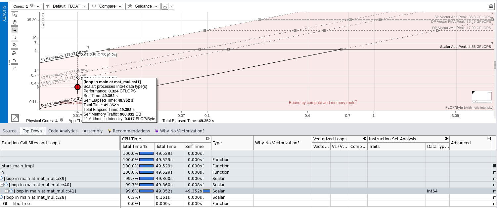

# Matrix Multiplication Paralellization

*Author: Marco Castagna*

## Head Of the Analysis
algorithm with cubical complexity O(N^3), 2n3 ops, 2n2 data

**Tools**: I used the icx compiler, the Intel one, and Intel Advisor GUI to perform the
most of the analysis.
**Machine**: SW2 Machine with Intel® Core™ i7-12700K Processor
 It has 20 processors:
- 12 core
- 8 performance cores with hyperthreading up to 2
- 4 efficiency 

advixe-gui

to record time execution i decide to add OpenMP library.

the source code present an optimization by design where the netested loops are inverted instead of the standard moltiplication formula,  as we saw in class
this let us to exploit the cache line both with spatial and temporary locality, even we pass from a n^2 store operation to n^3, the rewritten algorithm let us to save read memory time avoiding cache miss increasing the perfomrance

**hotspot identification**

starting with a baseline approach i compiled with icx -g -O0 -xHost -fiopenmp -o matmul  mat_mul.c 
and I analized the algortihm with **Data size** = 2000
-the execution time: 45.626744 seconds

the hotspot reside at row 41 (for (j = 0; j < n; ++j)): Questo singolo ciclo assorbe il 99.6% del tempo totale di esecuzione (49.352s su 49.529s totali).

compilando con -O0, il compilatore si è rifiutato di usare le istruzioni vettoriali AVX
la macchina sta calcolando una singola moltiplicazione tra double per ogni ciclo di clock. Questo si riflette nel tempo di esecuzione gigantesco (~45 secondi per una matrice "piccola" da 2000x2000)

il pallino sta leggermente sopra la diagonale della dram
arithmetic intensity = 0.017 Flop byte,
teoricamente l'operazione
c = c + a * b dovrebbe avere un'intensità di $2 \text{ FLOP} / 32 \text{ Byte} = 0.0625$. Il fatto che il valore sia ancora più basso (0.017) è colpa del flag -O0: il compilatore non sta tenendo le variabili i, j, k, a e b nei registri veloci, ma le sta ricaricando dalla memoria (stack) a ogni singola iterazione del ciclo

l'algoritmo naive è fortemente limitato dalla memoria (Memory Bound). Il Roofline Model posiziona l'hotspot principale (il ciclo più interno) sulla diagonale della DRAM Bandwidth, con un'intensità aritmetica di appena 0.017 FLOP/Byte. A causa dell'assenza di vettorizzazione (elaborazione puramente Scalare), il codice impiega oltre 45 secondi già per una matrice N=2000, dimostrando quanto l'accesso inefficiente alla memoria e la mancata allocazione dei registri penalizzino l'algoritmo originale

