# Matrix Multiplication Parallelization

*Author: Marco Castagna*

## Head of the Analysis

The algorithm has a cubic time complexity of $O(N^3)$, requiring approximately $2N^3$ operations and dealing with an $O(N^2)$ data footprint.

**Tools:** I used the Intel C Compiler (`icx`) and the Intel Advisor GUI to perform most of the analysis.
**Machine:** 210 room's Machine equipped with an Intel® Core™ i9-12900K Processor. It has 24 logical processors:

* 16 physical cores
* 8 Performance cores with Hyper-Threading up to 2
* 8 Efficiency cores
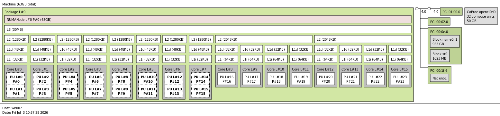

To accurately record the execution time, I decided to utilize the high-precision timers provided by the OpenMP library (`omp_get_wtime`).

The source code features a design optimization where the nested loops are inverted compared to the standard mathematical matrix multiplication formula. As discussed in class, this loop order (`i-k-j`) allows us to exploit the cache lines through both spatial and temporal locality. Although this shifts the memory stores from $O(N^2)$ to $O(N^3)$, the rewritten algorithm significantly saves memory read time by avoiding cache misses, ultimately increasing performance.


## **Hotspot Identification**

Starting with a baseline approach, I compiled the code disabling all optimizations (`icx -g -O0 -xHost -fiopenmp -o bin/matmul mat_mul.c`) and analyzed the algorithm with **Data size** = 2000, resulting in a computation time of 14.400218 seconds. I then decided to double the size to $N=5000$, which yielded a computation time of 227.300751 seconds
The hotspot resides at row 35 (`for (j = 0; j < n; ++j)`): this single loop consumes 99.9% of the total execution time (227.353s out of the 227.30s total).


By compiling with `-O0`, the compiler is forced to generate naive scalar instructions, completely bypassing the AVX vector capabilities. While Intel Advisor confirms the loop correctly processes **`Float64`** data, the massive execution time (~227 seconds) is driven by the total lack of register allocation. Without optimizations, the CPU is forced to reload loop indices and matrix elements from the memory hierarchy at every single iteration, executing one purely scalar addition and multiplication at a time.

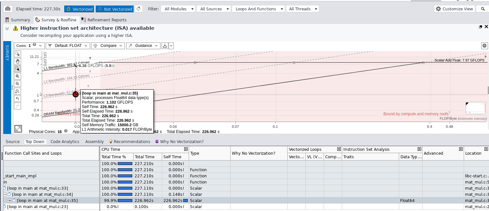
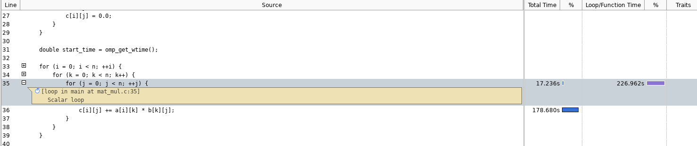

The unoptimized algorithm is heavily memory-bound, but the Roofline Model reveals an interesting detail: the main hotspot sits just below the L3 Cache Bandwidth limit (~67.78 GB/s and 1.13 GFLOPS), instead of dropping down to the slower DRAM limit.

The arithmetic intensity is very low (only 0.017 FLOP/Byte), compared to the theoretical value of 0.0625 (2 FLOPs / 32 Bytes) for the core operation c[i][j] += a[i][k] * b[k][j]. This drop happens because the -O0 flag disables register allocation. As a result, the compiler is forced to constantly reload loop variables and array pointers from the memory stack during every iteration.

However, since the loop sequence is optimized (i-k-j), the memory access is contiguous (good spatial locality). This allows the CPU's hardware prefetcher to bring data from the RAM into the L3 cache ahead of time. Because of this, the execution is bottlenecked by the L3 cache bandwidth and the use of scalar instructions, rather than the slow DRAM latency.


Figure above shows the assembly code when we compile with -O0 (no optimization). We can see that the compiler does not use the CPU registers well. Instead, it constantly reloads loop variables and matrix pointers from the stack using the %rbp pointer.

The biggest problem is at line 0x4013e4 with the instruction vmovsdq %xmm0, (%rax,%rcx,8). This instruction takes 89.392 seconds, which is 39.34% of the total execution time. It happens because the program saves the numbers into matrix C at every iteration, instead of keeping them inside a fast CPU register. Writing data to the main memory (RAM) is very slow and takes a lot of time. This is why memory operations represent 53% of the total performance loss.

---

## Vectorization Analysis and Best Sequential Time

To fix the memory bottleneck and the slow scalar execution from the baseline, I used the compiler's advanced optimizations for the SW2 machine's architecture.

**Compilation command:** `icx -g -O3 -xHost -fiopenmp -qopt-report=3 -o bin/matmul mat_mul.c`
**Data size:** N = 5000
**Execution Time:** 9.592203 seconds

Using the `-O3` and `-xHost` flags reduced the execution time by a factor of ~24x. To understand this massive speedup, I analyzed the vectorization report (`-qopt-report=3`). Because the nested loops are perfectly arranged (`i-k-j`) to respect spatial locality, the compiler successfully vectorized the innermost loop (`j`). The code was compiled using **AVX2** instructions with a physical vector length of 4 (packing four 64-bit `double` variables into a 256-bit register). Furthermore, the compiler applied aggressive **Loop Unrolling** (processing 8 elements per iteration) to keep the execution units fully saturated.

Running Intel Advisor on this optimized program confirms the report and shows a completely transformed Roofline Model:
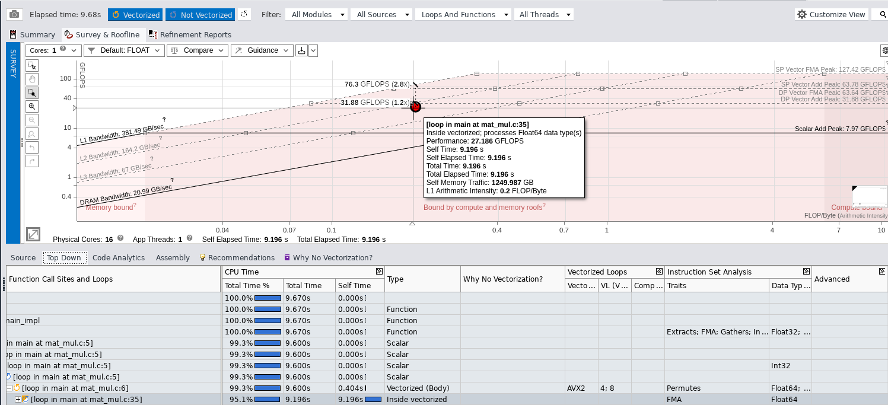

* **Instruction Set and FMA:** The hotspot transitioned from slow *Scalar Float64* execution to *Vectorized AVX2*. Crucially, it now leverages **FMA** (Fused Multiply-Add) hardware units, performing addition and multiplication simultaneously in a single hardware step.
* **Arithmetic Intensity:** The L1 Arithmetic Intensity improved significantly to **0.200 FLOP/Byte**. This proves that the variables are being efficiently reused within the fast CPU registers and L1 cache, drastically reducing the slow memory reloads.
* **Compute Performance:** The hotspot moved dramatically higher on the graph, peaking at **27.18 GFLOPS** (up from just 1.02 GFLOPS in the scalar baseline). This proves the bottleneck has shifted away from memory latency and is now fully exploiting the compute capabilities of the single physical core.

---

## Advanced Compiler Optimizations and Best Sequential Time

After setting a strong baseline with `-O3` and `-xHost`, I decide to increase the problem size from N 5000 to 10000 and
 test the advanced compiler flags to maximize sequential performance:

* **`-xHost`**: Tells the compiler to use the best instructions for the specific CPU running the code (enabling AVX2/FMA).
* **`-ffast-math`**: Relaxes strict floating-point rules, allowing the compiler to reorder math operations for faster execution.
* **`-ipo` (Interprocedural Optimization)**: Analyzes the whole program at once to optimize how data flows between functions.
* **`-fno-alias`**: Tells the compiler that the arrays (`a`, `b`, `c`) do not overlap in memory. This removes slow safety checks.

To measure the impact of these flags, I ran the algorithm with $N=10000$ using different combinations:

| Compiler Flags | Execution Time |
| --- | --- |
| `-O3 -xHost` (Baseline) | 76.061213 seconds seconds |
| `-O3 -xHost -ffast-math` | 76.023915 seconds |
| `-O3 -xHost -ipo` | 79.507378 seconds |
| `-O3 -xHost -fno-alias` | 76.115624 seconds |
| `-O3 -xHost -ipo -ffast-math -fno-alias` |  79.374703 seconds |
 

**Analysis of the Results**

Increasing the matrix dimension to $N=10000$ means the static memory footprint of each matrix is roughly 800 MB, resulting in about 2.4 GB of total RAM allocation. At this massive scale, the baseline `-O3 -xHost` configuration provided the best sequential time.

Breaking down the lack of improvement from the advanced flags:

**`-ipo`:** This flag did not improve performance because all our core logic resides exclusively within the `main` function, making the optimization completely unnecessary.
**`-ffast-math`:** Since our algorithm only relies on a basic multiply-add operation, there are no complex mathematical functions (like square roots or transcendental functions such as exponentials and logarithms) for the compiler to simplify or "cheat" on. The hardware FMA is already doing the absolute minimum work possible.
**`-fno-alias`:** This flag tells the compiler the matrices do not overlap. However, the compiler is already smart enough to generate clean, vectorized AVX2 code without it.

Therefore, the baseline compilation command (`icx -g -O3 -xHost -fiopenmp -o bin/matmul mat_mul.c`) perfectly applies vectorization without over-complicating the memory access, yielding our **Best Sequential Time of 76.06 seconds**.

---

## OpenMP

To compile the parallel version of the program, I used the following command:

```bash
icx -g -O3 -xHost -fiopenmp -o bin/matmul_p mat_mul_parallel.c

```
### First soluction adopted

I decided to insert the directive `#pragma omp parallel for default(none) shared(a, b, c, n) private(j, k) schedule(dynamic)` on the first of the three nested loops:

```c
#pragma omp parallel for default(none) shared(a, b, c, n) private(j, k) schedule(dynamic)
    for (i = 0; i < n; ++i) {
        for (k = 0; k < n; k++) {
            for (j = 0; j < n; ++j) {
                c[i][j] += a[i][k] * b[k][j];
            }
        }
    }

```

With this configuration, the threads divide the execution of the outermost loop (`i`). This means that every time a thread takes a single iteration `i` of the first loop, it runs the two inner loops entirely, which equals $N \times N$ iterations. I chose this approach to avoid **race conditions** and to allow each thread to process its portion of data without interference.

Since the workstation has a **hybrid architecture** (with different types of cores), I selected the **dynamic scheduler**.

If I had used the **static scheduler** with $N = 10000$ and 24 threads, the workload would be divided equally from the start: each thread would get exactly $10000 / 24 = ≈417$ iterations of the first loop. However, by using the dynamic scheduler, the workload division is managed at runtime by OpenMP. The distribution is not perfectly equal from the beginning; instead, each thread requests and processes a new block of work as soon as it becomes available.

I experimented multiple times by running the exact same code with both scheduling policies. The results show that executions with the dynamic scheduler are always slightly faster. This indicates that the static scheduler creates a **load imbalance** and extra overhead on the efficiency cores, which have smaller caches.

For example, with $N = 10000$:

* **Static Scheduling:** 34.022240 seconds
* **Dynamic Scheduling:** 31.731761 seconds


#### Performance Analysis

With an execution time of **36.67 seconds** for $N = 10000$, a major doubt immediately arises. I am highly skeptical about using 24 threads and only dropping from 76 seconds (sequential) to 37 seconds (parallel). This represents a very poor speedup.

Looking at the Roofline model, further questions appear:
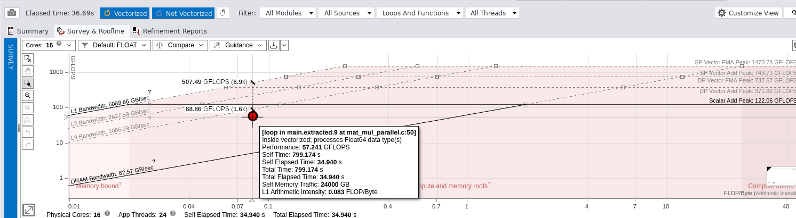

The system seems to be stuck in the exact same initial situation, where performance strictly depends on memory speed (**Memory-Bound**).

#### Investigating the Bottleneck

* **Could this be caused by False Sharing?** Reasoning about the structure, false sharing should not be an issue here. Each thread works on its own independent row `i`, meaning threads do not overwrite or interfere with each other's data cache lines.
* **Could it be a NUMA effect?** The answer is no. The workstation architecture does not feature separate RAM nodes for different sockets; the entire physical RAM is shared equally by all cores.

Therefore, the real issue must be related to **cache misses**. We can classify cache misses into three categories:

1. **Compulsory Misses:** Occur when data is read for the first time. These are unavoidable.
2. **Conflict Misses:** Caused by mapping conflicts or False Sharing. (Exluded).
3. **Capacity Misses:** This is the real problem.

#### The Mathematical Proof of Cache Thrashing

Let's analyze the memory footprint for $N = 10000$. Consider a single thread executing a single iteration of the outermost loop `i` (for example, Thread 0 handles `i = 0`). This thread must execute the remaining two nested loops ($k$ and $j$) entirely, from 0 to 9999.

The core accumulation formula is:

$$c[i][j] += a[i][k] * b[k][j]$$

To calculate a single row of matrix $C$, the thread requires:

 **Row `i` of Matrix $A$** that consists of 10,000 `double` elements, which take up about **80 KB**. It fits easily within the L1d or L2 cache of the core, but the formula require us also to iterate b[k][`j`] so the entire
**Matrix $B$** from top to bottom. A $10000 \times 10000$ matrix of `double` values requires **800 MB** of memory.

An 800 MB memory footprint completely floods the L1d, L2, and even the shared L3 cache of the processor.

#### Conclusion

While the CPU possesses massive computing power, the enormous volume of concurrent data requests completely chokes the memory bus. Every thread demands a quantity of data that cannot physically fit into its cache.

As a result, parallelism is severely degraded because all 24 threads are forcing simultaneous access to the physical RAM, constantly overwriting the shared L3 cache (**Cache Thrashing**). The threads spend roughly 90% of their execution time idle, waiting for the completely saturated memory bus to deliver data from the RAM.


### Final Solution: Second Approach Adopted

A well-known solution to break the Memory Wall is to rewrite the algorithm by splitting the data into smaller blocks that fit perfectly into the cache hierarchy. This can be achieved through techniques such as *Loop Tiling*, Cache-Aware Architectures (like the GotoBLAS approach), or Cache-Oblivious Algorithms (as described in the research papers in slides).

To implement this, I chose to apply Loop Tiling by nesting additional loops. This technique splits the memory space into smaller, bounded tiles to prevent cache saturation. More importantly, it increases the task granularity, allowing the cores to achieve maximum performance. While this is not the ultimate optimization and more advanced tuning is possible, my primary goal is to break the Memory Wall created by the previous algorithm.

```c
#pragma omp parallel for default(none) shared(a, b, c, n, BLOCK_SIZE) schedule(dynamic)
    for (int i = 0; i < n; i += BLOCK_SIZE) {
        for (int k = 0; k < n; k += BLOCK_SIZE) {
            for (int j = 0; j < n; j += BLOCK_SIZE) {
                
                // Boundary Computation prevents Segmentation Faults
                int i_end = (i + BLOCK_SIZE > n) ? n : i + BLOCK_SIZE;
                int k_end = (k + BLOCK_SIZE > n) ? n : k + BLOCK_SIZE;
                int j_end = (j + BLOCK_SIZE > n) ? n : j + BLOCK_SIZE;

                // Inside the Cache block 
                for (int ii = i; ii < i_end; ++ii) {
                    for (int kk = k; kk < k_end; ++kk) {
                        // This loop will be vectorized in AVX2/FMA by the compiler
                        for (int jj = j; jj < j_end; ++jj) {
                            c[ii][jj] += a[ii][kk] * b[kk][jj];
                        }
                    }
                }
            }
        }
    }

```

We can analyze this implementation using the **PCAM Methodology** (Partitioning, Communication, Agglomeration, Mapping) studied during the course:

#### 1. Partitioning

I applied **domain decomposition**. Instead of treating the $10000 \times 10000$ matrices as massive, monolithic blocks, I partitioned the data domain by introducing internal loops. The matrix space is split into small $64 \times 64$ sub-matrices (tiles), which serve as the fundamental unit of computation.

#### 2. Communication

The algorithm is designed to achieve an ideal scenario: *embarrassingly parallel computation* with no need for communication. The problem is decomposed so that tasks can run concurrently without sharing data. By assigning independent horizontal strips of Matrix $C$ to each thread, I avoided memory collisions. This eliminated the need for `locks`, `barriers`, or expensive collective operations like `reductions`. Every thread operates in total isolation within its cache.

#### 3. Agglomeration

Instead of passing individual $64 \times 64$ tiles directly to OpenMP (which would create a granularity that is too fine and generate massive scheduling overhead), I **agglomerated** the workload. I placed the `#pragma omp parallel for` directive only on the outermost loop `i`. This packs entire horizontal bands (comprising 64 rows by 10,000 columns for $N = 10000$) into a single macro-task. This strategy ensures a very high computation-to-overhead ratio, allowing the threads to perform calculations continuously for several milliseconds (coarse-grained parallelism).

#### 4. Mapping

The mapping phase is delegated directly to the runtime scheduler, following a master-slave/worker paradigm. This is managed by configuring OpenMP with the `schedule(dynamic)` policy, which helps balance the workload across the cores at runtime.


#### Performance Analysis with Loop Tiling

On the `wk007` workstation (Lab 210) using 24 OpenMP threads, the execution time for the tiled algorithm drops significantly:

`Computation time (N=10000, BLOCK=64): 8.602647 seconds`

This demonstrates a clear and substantial speedup compared to the untiled parallel version, proving that our cache-blocking strategy successfully bypassed the memory bottleneck.

This performance leap is highly visible when examining the updated Roofline model:
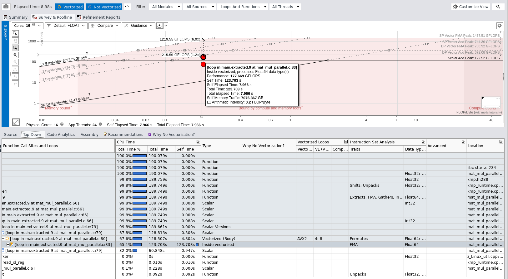

The computational throughput reaches an impressive **177 GFLOPS**, a massive increase compared to the ~57 GFLOPS recorded in the previous parallel run without tiling.

However, even with this great result, the graph shows that the program is still not using the maximum power of the CPU when all cores are active. To better understand this behavior and identify remaining overheads, a deeper investigation into thread scalability and problem size scaling is required. So, I evaluated the performance across three different matrix sizes $5000 \times 5000$, $10000 \times 10000$, and $15000 \times 15000$ to systematically analyze both **Speedup** and **Parallel Efficiency**.


---

## Scalability

Graphs generated by the `benchmark.sh` script:
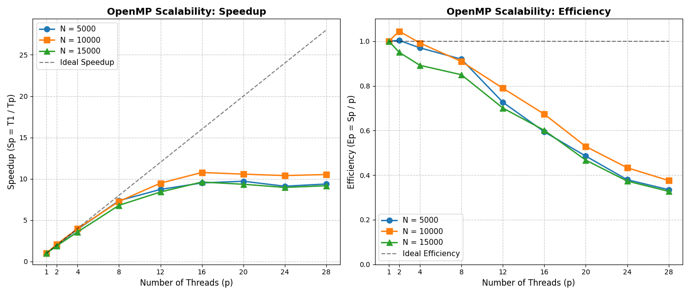

What can we say? In all runs, the speedup is linear up to 8 threads, which are very likely the Performance Cores (P-Cores). When moving to the Efficiency Cores (E-Cores), the situation changes and the curve flattens out when reaching 16 threads. Beyond that point, the logical Hyper-Threading threads are used, entering Simultaneous Multithreading (SMT). In general, these threads are great for a computer, but in our algorithm, they do not give us any extra speedup or high parallelism. In fact, the theoretical formulas for speedup and efficiency give us a very clear picture of the computer architecture; the efficiency clearly stays very high on the P-Cores.

This performance drop of the E-Cores creates a sort of implicit barrier. This means that even if the faster threads finish their task, they literally stand still waiting for the slower ones, creating a **load imbalance**. I try to mask this problem with dynamic scheduling, but this overhead is always present. One solution that comes to mind is to distribute the workload unequally: giving much more to the Performance Cores and less to the Efficiency Cores, maybe using a different block size for them. I notice that they share the L2 cache, which shows me that they fill up their memory much faster than the others. Therefore, it is normal that with all 16 physical cores, the curve flattens out when half of the cores in the system are slower and have less capacity.

Intel Advisor confirms this:
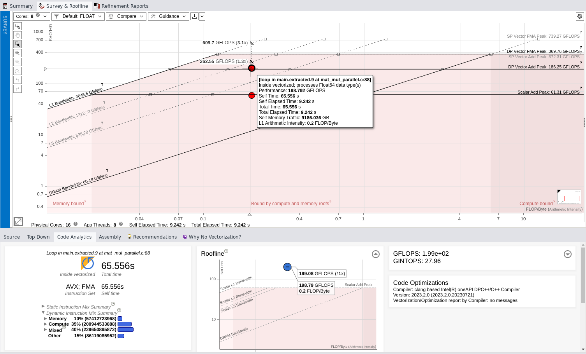

where the 8 cores perform better than all 16 together, reaching almost 200 GFLOPS and hitting the intrinsic computing limit of the machine!

Looking at the images, the most optimal problem size seems to be the one with matrices of $N = 10000$, where the speedup and efficiency are better compared to the other sizes.

In conclusion, I experimented with different block sizes to see how they fit into the cache and to find the best configuration for this algorithm on this hardware. I tested blocks of $32 \times 32$, $64 \times 64$, and $128 \times 128$ on the various problem sizes used before:
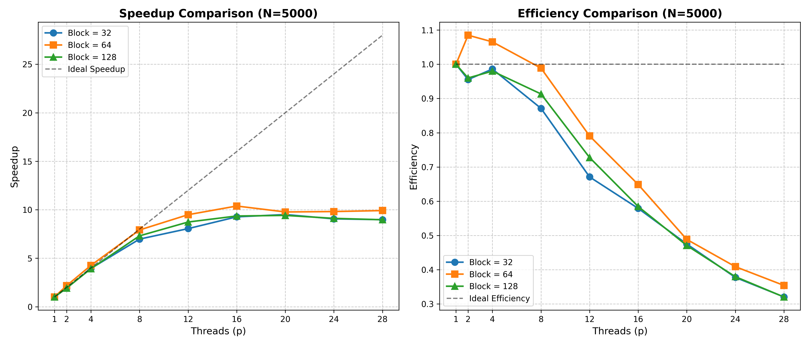
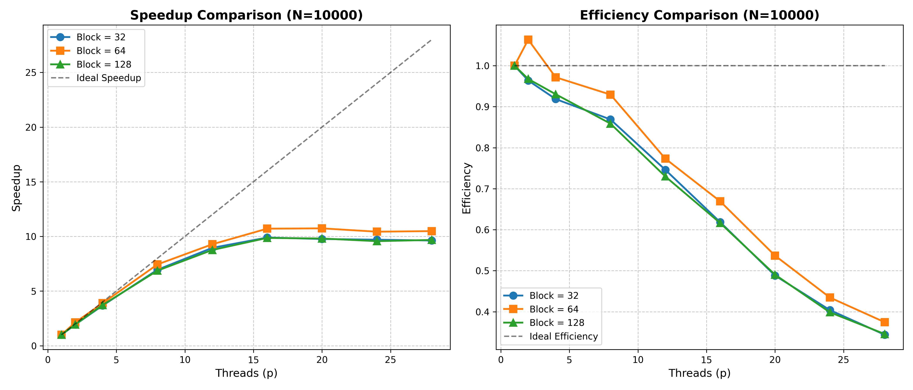
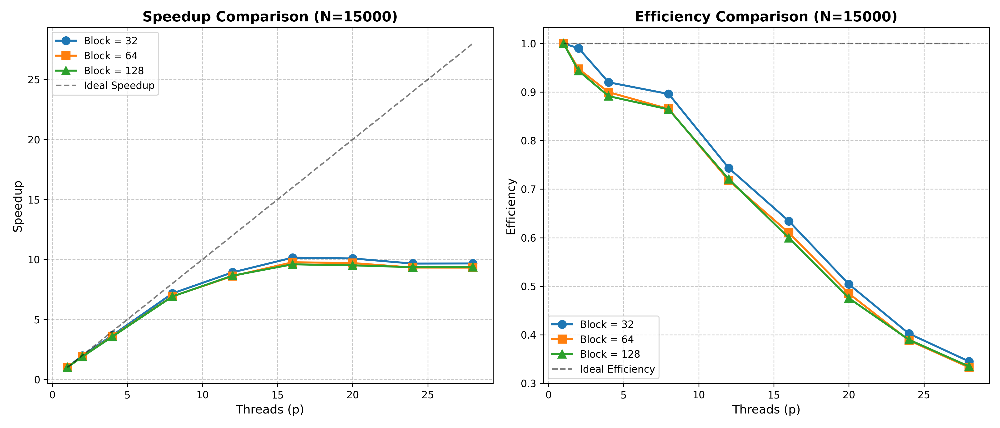

The clear winner remains the $64 \times 64$ size, but there is something interesting when we move to larger $N$. In the last image with $N = 15000$, the algorithm with the smaller blocks performed the best compared to the others. This is quite strange but makes it very interesting. It makes me think that as the problem grows, proper decomposition has a big impact on performance, meaning that we must build the algorithm strictly based on the volume of data.

Regarding the experiments, I conclude that the parallel computation achieved a good speedup. In these empirical tests, we crash directly into theory, where reaching perfect performance is incredibly difficult. To optimize everything in the best way, it is not enough to make things cache-optimized; we must also consider core heterogeneity, which heavily complicates the aspect of load balancing.


## CUDA

google colab
architetttura cpu per il test sequenziale: 
Architecture:                x86_64
  CPU op-mode(s):            32-bit, 64-bit
  Address sizes:             46 bits physical, 48 bits virtual
  Byte Order:                Little Endian
CPU(s):                      2
  On-line CPU(s) list:       0,1
Vendor ID:                   GenuineIntel
  Model name:                Intel(R) Xeon(R) CPU @ 2.20GHz

!gcc -O3 -march=native -fopenmp matmul.c -o matmul_seq

Computation time (N=5000): 91.53734 seconds
Computation time (N=10000): 764.730147 seconds
Computation time (N=15000): 2733.177186 seconds
situazio diverso rispetto a prima, molto piu lenta 

device:
```
--- Device 0: "Tesla T4" ---
  CUDA Capability Major/Minor version:          7.5
  Total amount of global memory:                14.56 GBytes
  Number of multiprocessors (SMs):              40
  Total amount of constant memory:              65536 bytes
  Total amount of shared memory per block:      49152 bytes
  Total number of registers available per block: 65536
  Warp size:                                    32
  Maximum threads per multiprocessor (SM):      1024
  Maximum threads per block:                    1024
  Max dimension size of a thread block (x,y,z): 1024, 1024, 64
  Max dimension size of a grid size    (x,y,z): 2147483647, 65535, 65535
```

dai dati ricavati dal dispositivo, possiamo intravedere il numero dei 40 SM,e il max thread per block che ci dice come strutturare i blocchi nel nostro codice, e una memoria globale di 14.56 GB, ampiamente sufficiente per allocare le matrici di test fino a $N=15000$
leggendo il modello tesla 4, ho investigato sulla gpu, la version è 7.5
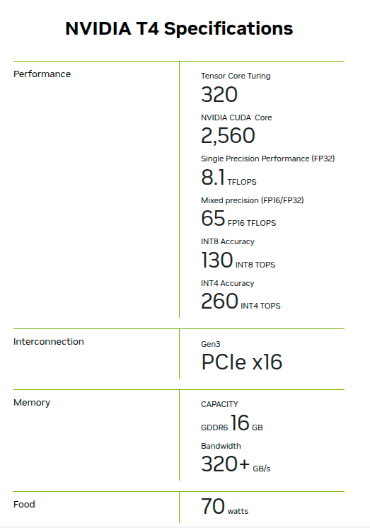
guardando le prestazione, vedo che ha i tensor core, quindi perfetti per i prodotti tra matrici che in un colpo solo di clock fanno un intero prodotto fra matrici, ottimo per rete neurali.

vedo anche un sacco di nvidia cuda core 2560, divisi i 40 SM, ognuno ha 64 cuda core!
ma dall'immaigine vedo solo prestazioni di Single Precision Performance (FP32), Mixed precision (FP16/FP32), INT8 , INT4
senza vedere però i FP64 che fanno al nostro problema , visto che faremo un prodotto tra matrici di soli double precision!
scoprpro dal vendor che la gpu è Basata sulla architettura NVIDIA Turing.
e guardando un po' la documentazione NVIDIA-Turing-Architecture-Whitepaper
vedo un SM strutturato in questo modo
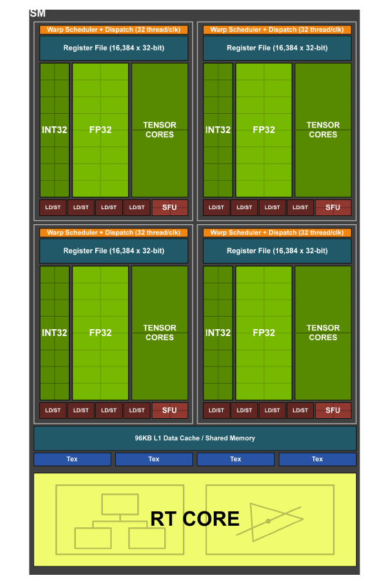

il chè non vedo core allestiti con alu fp64, guardando piu attentamente il documento mi accorgo 
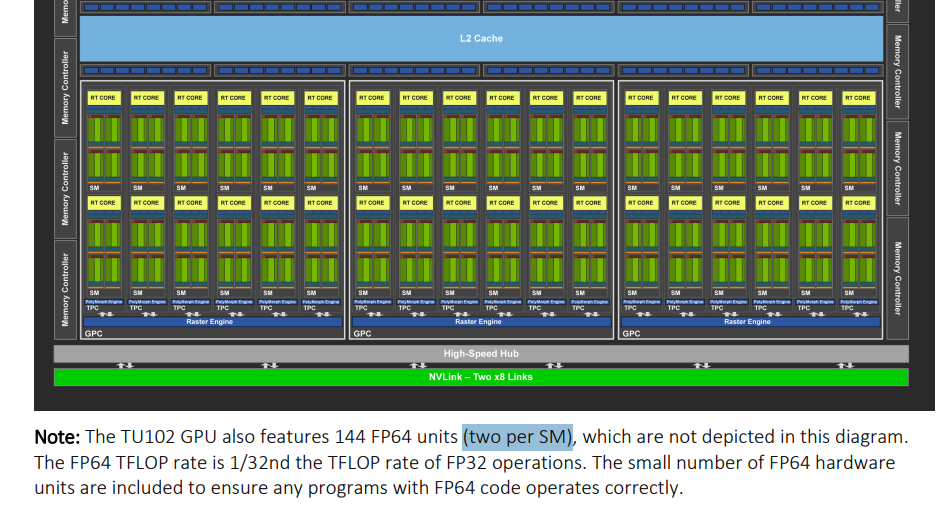

quidni i core di punta di questa gpu sono gper FP32 mentre gli fp64 sono solo per compatibilità, e con perfomrance molto ridotte,
1/32nd the TFLOP rate of FP32 operations , quindi se sono 8.1 TFloPs i FP32 i FP64 sono a 0,25 TFlops, e abbiamo solo 80 unità (2 per ogni SM), questa gpu sembrerebbe pensata per inferenza ai e grafica per lo più, non per calcolo scentifico HPC, mentre per questo tipo  di calcoli le A100, v100, h100, sarebbero piu adeguate che hanno il rapporto fp64:fp32 1:2 , ma su colab il piano gratuito ci fa usare solo la tesla per i nostri esperimenti

quindi abbavendo solo 2 alu fp64 e divisi i thread di un warp (32), un operazione fp64 costa 16 giri di clock!!!


### first solution adopted
blocchi bidimensionali multipli del warp così vengono usati a pieno i warp, ho scelto inizialmente blocchi 16x16, costruido un enorme griglia di blocchi bidimensionale,
pensare l'algoritmo che ogni thread calcola un solo elemento c, quindi si puo fare riga per colonna classico,quindi ogni thread deve fare riga per colonna per quel elemento (e quindi deve sapere quale riga e quale colonna), scorrendo tutte le colonne di una data riga row, e tutte le righe ad una speficia colonna col, quindi somma di prodotto di riga per colonna, ma assegnando comunque ad ogni thread celle contigue per efficienza sfruttando il Memory Coalescing. ogni thread quindi si calcola la propria pozione di c usando griglia globale bidimensionale dei blocchi, quindi logicamente creo una griglia enorme grande quanto c, divisa in blocchi logici che verranno schedulati ai vari SM in parallelo, e ogni thread di quei blocchi hanno una posizione globale row e col in base a blockid.y* blockDim+ threadid.y e blockid.x* blockDim+ threadid.x (inportante per .y si indica posizione riga). In questo modo ogni thread sa quale riga e quale colonna deve scorrere! per poter costruire un amtrice di blocchi precisi calcolo (n/dim blocco , n/dim blocco) ma dato che il calcolo dei blocchi deve essere intero, ci aggiungo un pezzet per fare bene l'arrotondamento di dimmensione blocco -1 sesempio se blocco da 16x16 (n+15/16, n+15/16) in questo modo anche se non è divisibile perfettamente per 16 rieso a prendere i bordi!

una volta deciso come partizionare, il calcol procede semplicemente al prodotto matriciale, nella gpu devo pensare questo caclolo monodimensionale, ma l'dea è quella di sfruttare questa moonodimensione e far prendere gli elementi necessari per matmul ad ogni thread da a e da b, quindi basta un solo ciclo fino ad n, e fare semolicemente i calcoli, dalla global devo prendere da a pensando alla row del thread per n quindi trovanndo la riga giusta + indice di scorrimento k, mentre per b devo saltare di riga in riga quindi k deve spostarsi di n ogni volta e per prendere la colonna giusta ci sommo col del thead


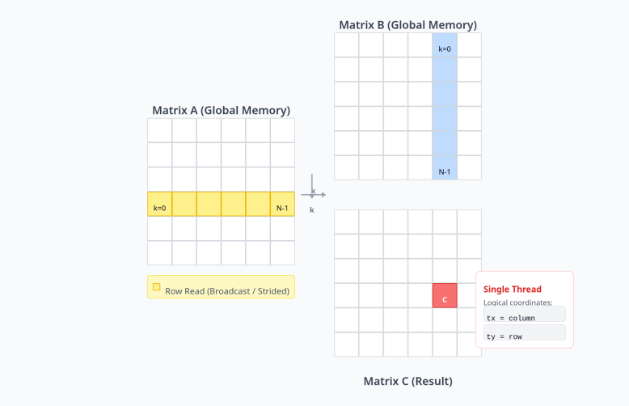


```c
__global__ void matMulKernel(double *a, double *b, double *c, int n) {

    int col = blockIdx.x * blockDim.x + threadIdx.x;
    int row = blockIdx.y * blockDim.y + threadIdx.y;

    // check that the thread is within the matrix boundaries
    if (row < n && col < n) {
        double sum = 0.0;

        // 1D array simulating a 2D matrix (row * n + col)
        for (int k = 0; k < n; k++) {
            sum += a[row * n + k] * b[k * n + col];
        }
        c[row * n + col] = sum;
    }
}
```


quindi con semplicità si riesce a parallelizzare
ottendendo un run con n=10000

```
Matrix Dimension N           : 10000
Transfer Time CPU -> GPU     : 340.948517 ms
GPU Kernel Computation Time  : 8916.573242 ms
Transfer Time GPU -> CPU     : 167.988388 ms
Total Time (Data + Compute)  : 9425.509766 ms
```
9 secondi e mezzo circa e uno speedup di circa 81 dal run sequenziale

profilando, noto che il maggior delay non sta nel passaggio cpu /gpu, ma bensì l'esecuzione del kernel, con nproof ci dice che il 90.67%  del tempo è usato dal l'esecuziobne del kernel: GPU activities:   90.67%  1.26170s  matMulKernel(double*, double*, double*, int), e piu umento n e piu l'esecuzione è presa dal kernel, 94% n 10k, e 97% n=15k
profilando piu accuratamente suu un visual profile, su nvidia snight: su un run n=10k

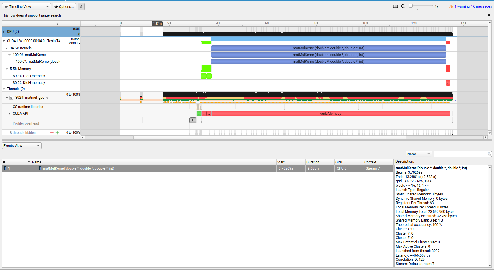 

si vede chiaramente che la maggoirprarte del tempo di esecuzione è usato dal kernel, ma una cosa che noto e che non ho utilizzato è la shared memory.

la global ci pesa 400-800 clock cycles
la shared  2-4 clock cycles

sicuramente l'algoritmo puo essee scritto meglio, così com'è ogni thread pesca dalla global ogni elemento di a e di b per fare il prodotto e lo fa n volte, sapendo che la global è lentissima, l'algoritmo è ineficciente, anche se c'è il memory cohaleshing che fa una sola lettura in memoria per il warp, sempre se il warp è disposto bene ovvero thread richiedono elementi contigui in memomoria (nel nostro caso tutti hanno un row e col e sono contigui), comunque non c'è una temporary locality, le cache essendo piccole non aiutano, e una volta il blocco finito, i thread del blocco successivo richiedono magari gli stessi valori del precedente, e così via nei blocchi contigui. e comunque si legge sempre dalla global. quindi una situazione memory bound!


### Soluzione 2

Per poter limitare il più possibile l'utilizzo della memoria globale, è necessario coordinare i thread del blocco usando proprio la memoria Shared. Per calcolare un elemento della matrice C, l'idea è di procedere per "mattonelle" (Tile), analogamente a quanto fatto con OpenMP, piuttosto che muovere intere righe o colonne alla volta.

Per quanto riguarda la fase di agglomerazione, in OpenMP si assegnava il calcolo di una "striscia" di C (fatta da tanti pezzetti uno affianco all'altro) a un singolo thread. In CUDA applichiamo un concetto analogo, ma usando un intero blocco di thread, con il fine di calcolare non un solo elemento, ma una mattonella completa di C. Di conseguenza, facciamo scorrere questo blocco di thread esattamente sulle mattonelle delle matrici A e B della stessa dimensione del blocco, muovendoci verso destra per A e verso il basso per B.

Per farlo, ogni blocco alloca due porzioni di memoria Shared dedicate esclusivamente a quei thread (della stessa dimensione delle mattonelle), nelle quali verranno inseriti i valori di A e di B necessari per il calcolo. Queste aree funzionano come una cache personale da usare ad ogni iterazione. La coordinazione dell'algoritmo si divide in due fasi distinte, separate da barriere di sincronizzazione (`__syncthreads()`):

Per ogni mattonella logica `t`:

* **Fase 1 (Lettura):** Ogni thread del blocco legge due valori dalla Global Memory, relativi alla propria posizione locale nella mattonella (`ty, tx`) e, soprattutto, alla propria posizione nella griglia globale (`row, col`). Considerando che lo scorrimento di A avviene sulla stessa riga e quello di B sulla stessa colonna, per la mattonella corrente `t` ogni thread preleva due valori e li salva nelle aree dedicate in Shared Memory. In questo modo, le due mattonelle condivise si riempiono con una singola lettura cooperativa (ogni thread carica esattamente un operando per matrice).
* **Fase 2 (Calcolo):** Tutti i thread eseguono i calcoli usando solo i propri registri privati e leggendo ESCLUSIVAMENTE dalla Shared Memory. Ogni thread calcola il prodotto scalare moltiplicando i valori della sua riga in Shared-A per quelli della sua colonna in Shared-B.

Con questo approccio, le letture dalla lentissima Global Memory vengono ridotte a sole due per ogni thread a ogni step logico, seguite da un'unica scrittura finale del risultato in C al termine delle iterazioni.

---


```c
__global__ void matMulKernel(double *a, double *b, double *c, int n) {
    __shared__ double As[TILE_SIZE][TILE_SIZE];
    __shared__ double Bs[TILE_SIZE][TILE_SIZE];

    int tx = threadIdx.x;
    int ty = threadIdx.y;
    int col = blockIdx.x * TILE_SIZE + tx;
    int row = blockIdx.y * TILE_SIZE + ty;

    double sum = 0.0;

    for (int t = 0; t < (n + TILE_SIZE - 1) / TILE_SIZE; t++) {
        if (row < n && t * TILE_SIZE + tx < n)
            As[ty][tx] = a[row * n + t * TILE_SIZE + tx];
        else
            As[ty][tx] = 0.0;

        if (t * TILE_SIZE + ty < n && col < n)
            Bs[ty][tx] = b[(t * TILE_SIZE + ty) * n + col];
        else
            Bs[ty][tx] = 0.0;

        __syncthreads();

        for (int k = 0; k < TILE_SIZE; k++) {
            sum += As[ty][k] * Bs[k][tx];
        }
        __syncthreads();
    }

    if (row < n && col < n) {
        c[row * n + col] = sum;
    }
```
risultati:

BlockSize: 16x16
H2D Time : 358.513092 ms
Kernel Time : 8225.050781 ms
D2H Time : 170.397049 ms
Total Time (Data + Compute)  : 8753.960938 ms

speedup 87! supereto il precedente di 81


## Scalabilità
dato che l'arcitettura non ci permette di modificare a piacimento il numero dei thead ma bensì solo il dimensionamento dei blocchi
ho pensato di confrontare in 3 dimensionamenti diversi lo speedup e l'efficency
ho pensato a provre blocchi 8x8, 16x16, 32x32 (il max supportato), per ogni dimensionamento n (5000, 10000, 15000)

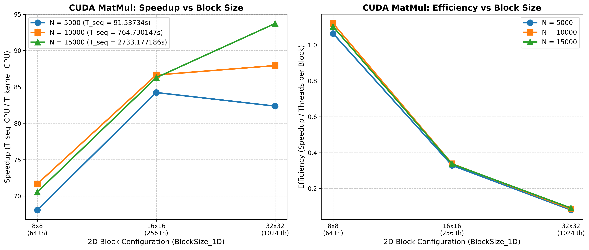 

cosa è successo?
con bocchi 8x8 lo speed up è quello piu basso, in tutte le casistiche!
avendo blocchi da 64 prendendo n=5000 avremo da schedulare 625 blocchi x 625 = 390.625 blocchi
tantini, circa 10 mila ad ogni SM, overhead assicurato troppi blocchi e pochi thread, In un contesto Compute-Bound limitato dalle unità FP64, tutti questi context switch crea un collo di bottiglia.
però per quanto riguarda l'efficienza è la configurazione piu efficiente, ed è normale con così pochi thread c'è meno utuilizzo dei registri e un miglior utilizzo hardware da parte di tutti i thread.
per quanto riguarda 16x16 sembra un buon compromesso per tutte i dimensionamenti
e 32x32 sembra trarre vantaggio a un dimensionamento grande.
ovviamente su dimensionamenti piccoli ci sono meno blocchi e quindi c'è meno sfruttamento dell'occupancy, i context switch veloci sono pochie e non si riesce a nascondere la latenza! e c'è un consumo elevato di registri che potrebbbero richiedere piu di quelli disponibili! infatti l'efficency potrebbe essere un indizio su cui investigare affondo

concludo infine che molto sicutamente l'approccio Cuda è quello piu versatile, moderno, ma nel mio caso dato il limite harware i risultatit sono pressochè simili a quelli con openMP guardando i tempi di esecuzione, ovviamente sono architetture completamente diverse e due esempi separati, ma la  potenza dei core cpu sono un buon esempio che non sono da sottovalutare nel parallelismo! sono molto soddifsfatto e sono molto cursioso a vedere i riusultati se avessimo usato i tensor core 


comandi utili 
scrot -s screenshot.png
advixe-gui
